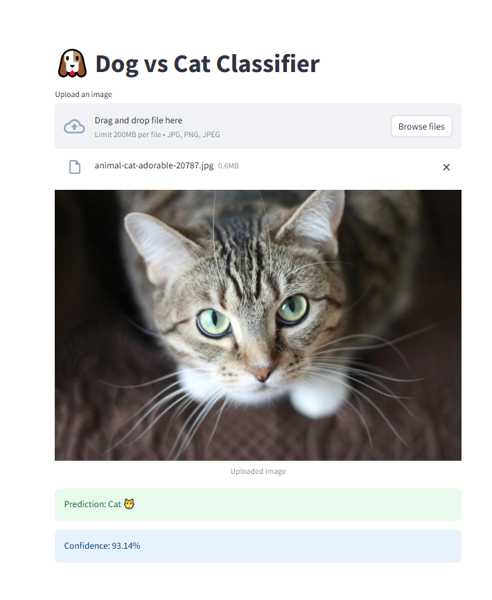

🐶🐱 Dog vs Cat Classifier (Deep Learning)

A deep learning web application that classifies images as Dog 🐶 or Cat 🐱 using a Convolutional Neural Network (CNN) built with PyTorch and deployed using Streamlit.

🔗 Live Demo
👉 https://cats-dogsclassifier-ac5feq2xkzkip3p7nryhhs.streamlit.app/

<<<<<<< HEAD
## App Access
https://cats-dogsclassifier-ac5feq2xkzkip3p7nryhhs.streamlit.app/

## Run

pip install -r requirements.txt  
python train.py  
streamlit run app.py

## Snap Shots

=======

🚀 Features
Upload any image and get instant prediction
Displays prediction with confidence score
Image preprocessing and normalization
Data augmentation for improved performance
Clean and interactive UI using Streamlit

🧠 Model Details
Custom CNN architecture
Conv → ReLU → MaxPool layers
Dropout for regularization
Fully connected layers for classification
Optimized using Adam optimizer

📊 Accuracy
Achieved ~80–85% validation accuracy

🛠️ Tech Stack
Python
PyTorch
Torchvision
Streamlit
PIL
NumPy

▶️ How to Run Locally
pip install -r requirements.txt
python train.py
streamlit run app.py

📸 Screenshots
Home Page

Prediction Result

Project Structure

cats-dogs-classifier/
├── app.py               # Streamlit web application
├── train.py             # Model training script
├── model.py             # CNN model definition
├── dataset.py           # Dataset loading and preprocessing
├── utils.py             # Utility functions (accuracy, etc.)
├── model.pth            # Trained PyTorch model (auto-generated)
├── requirements.txt     # Dependencies
└── README.md            # Project documentation
>>>>>>> ca89ba0 (update readme)
